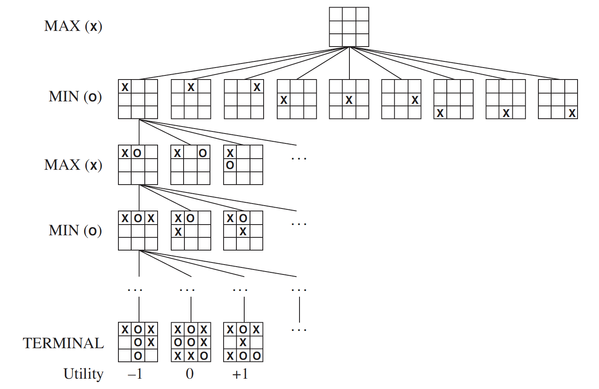
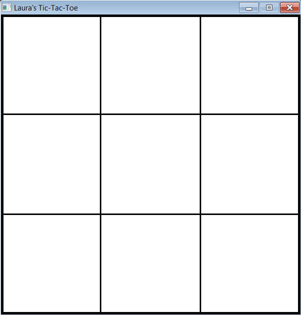
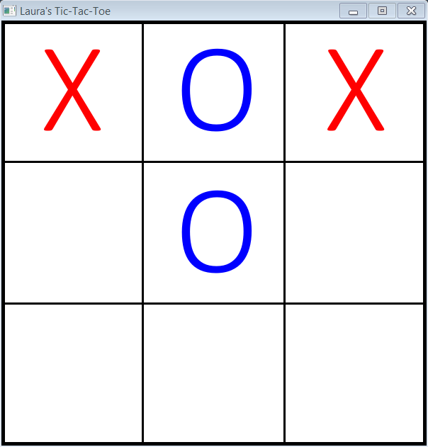

# Tic-Tac-Toe with AI

A Tic-Tac-Toe GUI application with an AI opponent.

## Background

Tic-Tac-Toe is a two-player, turn-based game. The actions and win conditions are straightforward and simple to understand. The number of actions in each state is limited, and the state of the game is easily represented.

Two players (each represented by *X* and *O*) take turns marking the spaces on a 3x3 grid. The player who succeeds in placing three of their markers in a horizontal, vertical, or diagonal row wins the game [1].

The possible outcome for a player is a win, loss or draw. A win for one player implies a loss for the other; for this reason, Tic-Tac-Toe is a **zero-sum game**.

Each player's goal state is a win. As such, the player's goals are competing, which leads to an **adversarial search** problem.

## Motivation

This project implements an AI opponent which employs different AI search algorithms:
* Optimal decision
    * Minimax
    * Alpha-beta pruning
* Imperfect real-time decision
    * Alpha-beta pruning with cutoff (evaluation function)

### Minimax

The minimax algorithm searches the entire game search space and yields a perfect decision for the AI. Thus, the AI using minimax is unbeatable.

Minimax searches until a terminal state is found. When a terminal state is found, minimax returns the utility of that state {1, 0, -1}. Let's assume I am player X. I want to max(X) while min(O).



### Alpha-Beta

Alpha-beta prunes prunes away large and unecessary parts of the minimax game tree, so it too yields an optimal decision. Both minimax and alpha-beta pruning require searching all the way to the terminal states (for at least one portion of the tree).

### Alpha-Beta with Cutoff

Because the Tic-Tac-Toe solution space is relatively small (9! = 362,880), it is possible to employ an optimal decision. For more complicated games searching the whole tree is not possible (such as Chess). An evaluation function can be implemented to approximate the best decision for the AI.

In my application, I stop the alpha-beta search at a depth of 3 and call the following evaluation function, f(n), which I made up:

Look at all possible move combinations for each player for the next two moves:

f(n) = 1, number wins O > number wins X

f(n) = 0, number wins O = number wins X

f(n) = -1, number wins X > number wins O

This evaluation function actually performs very well. While it is not unbeatable, it approximates an intelligent AI in less time.

### Tradeoffs

This project highlights the tradeoffs in time complexity and space complexity between optimal and imperfect AI search algorithms.

The time for the AI to returns its best, first move is shown below according to the search algorithm.

| Search Algorithm       | Time to Decision [s] |
|------------------------|----------------------|
| Random                 | 0.017685             |
| Minimax                | 0.495434             |
| Alpha-Beta             | 0.049923             |
| Alpha-Beta with Cutoff | 0.022828             |


Minimax takes nearly half a second to place its first move! Alpha-beta shaves this number down by a factor of 10. Alpha-beta with cutoff does even better.

## Built With

* Python 2.7
* [Pygame](https://www.pygame.org/)

## Usage

```
$ python run_tic_tac_toe.py
```

This will launch a pygame window



The terminal will prompt the choice of AI

```
Choose AI. [1/2/3/4]
1. Random
2. Minimax
3. Alpha-beta
4. Alpha-beta with Cutoff
>
```

Once the AI is chosen, it's off the races. Place your marker (*X*) and the AI will place its marker (*O*) until a terminal state is found.



When the game is finished, you can then choose to play again and lose to your hearts desire

```
Play again? [Y/N]
>
```

## Author

**Laura Kocubinski** [laurakoco](https://github.com/laurakoco)

## Acknowledgments

* Boston University MET Master Science Computer Science Program
* MET CS 664 Artificial Intelligence

## References

[1] [https://en.wikipedia.org/wiki/Tic-tac-toe](https://en.wikipedia.org/wiki/Tic-tac-toe)

[2] Russell, Stuart J., and Peter Norvig. Artificial Intelligence: a Modern Approach. Pearson, 2010.

